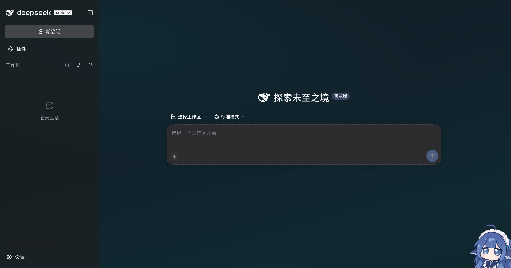
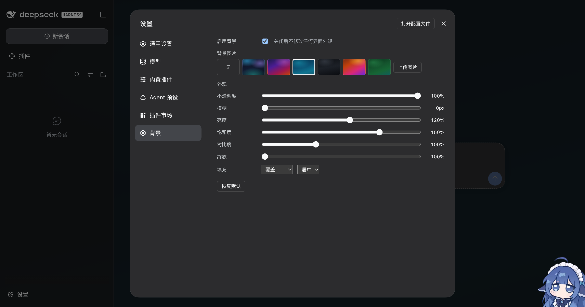

# dsh-desktop-background

给 **DeepSeek Harness 桌面版**（以及 `dsh web`）换上一张自己的背景图，并把界面调成半透明让背景透出来。

中文 | [English](README.en.md)



一个标准的 DSH bundle 插件：`dsh plugin` 一键安装，不需要会话令牌，不需要联网，不依赖任何构建步骤（装完即是可运行的纯 JavaScript）。

## 它做什么

DSH 本身**没有**背景图 / 壁纸 / 遮罩能力（`0.2.0-rc.2` 里 `wallpaper` 出现 0 次），所以这个插件自己造了一层：

- 在应用**下方**（`z-index: 0`，`#root` 提到 `1`）画一个固定的背景层，**浅色与深色主题共用同一张图**；
- 背景支持 **透明度、模糊、亮度、饱和度、对比度、缩放、填充方式（5 种）、位置（9 种）**；
- 因为 DSH 的面板本身是不透明的，插件会把**应用表面调成 72% 半透明**，否则背景会被面板整块挡住 —— 只画图不改表面是看不见效果的。这是「显示背景」的一部分而不是一个要用户去调的开关，所以它没有对应的设置项；
- **侧边栏默认与主界面同色同深度**：DSH 给侧边栏填的是另一种颜色，同一个透明度下两边看起来深浅不一致，所以插件默认把它也刷成主界面的颜色；想反过来就打开「自定义边栏深度」；
- 图片来源：**本地上传**（PNG / JPEG / WebP / GIF / AVIF，单张 ≤ 16 MB）或**6 条内置渐变预设**。



## 安装

### 桌面版（Electron 客户端）

桌面版把插件装在 `desktop` profile 里，而 `desktop` profile **只能由应用自己的 CLI 入口管理** —— 直接跑 `dsh plugin --profile desktop …` 会被拒绝，报 `profile "desktop" is managed exclusively by the Electron application`。

**方式一（推荐）：让插件市场装。** 在桌面版里打开 **设置 → 插件市场**，搜索 `dsh-desktop-background` 安装。装完即在运行中的宿主上生效，**不需要重启**。

**方式二：命令行。** 用应用内自带的入口：

```sh
# macOS 默认安装位置
DSH="/Applications/DeepSeek Harness.app/Contents/Resources/runtime/cli/bin/dsh"
"$DSH" plugin --profile desktop add dsh-desktop-background
```

从 GitHub 或本地目录装同样可以（本仓库**没有** `install`/`prepare`/`postinstall` 脚本，所以不会被 pnpm 的 `allowBuilds` 拦下）：

```sh
"$DSH" plugin --profile desktop add github:jgl0306/dsh-desktop-background
"$DSH" plugin --profile desktop add /path/to/dsh-desktop-background   # 本地源码，link: 形式
```

卸载：

```sh
"$DSH" plugin --profile desktop remove dsh-desktop-background
```

### dsh web

```sh
dsh plugin --profile web add dsh-desktop-background
```

重启 `dsh web`，然后打开 **设置 → 背景**。

## 使用

安装后默认是**关闭**的（`enabled: false`、图片是「无」），**装上不会改动任何界面外观**。打开 **设置 → 背景**：

1. 勾选 **启用背景**；
2. 在 **背景图片** 里挑一张（点缩略图选一个内置渐变，或点 **上传图片** 传自己的）。选「无」就等于不加背景；

设置面板的文字**只有中文**（插件名就叫「背景」）。所有改动**即时生效并自动保存**（关掉设置窗口也不会丢），不需要点保存、不需要重启。

### 设置项

| 设置项 | 范围 | 默认 | 说明 |
|---|---|---|---|
| 启用背景 | 开 / 关 | 关 | 关掉后 `data-dsh-dbg` 属性被移除，**所有样式立即失效**，界面回到原样 |
| 背景图片 | 无 / 6 条内置渐变 / 已上传图片 | 无 | 浅色与深色主题共用这一张 |
| 不透明度 | 0 – 100% | 100% | 背景层整体透明度 |
| 模糊 | 0 – 40 px | 0 | 背景层模糊；图层会向外扩张 `2 × blur`，避免边缘露出透明边 |
| 亮度 | 20 – 200% | 100% | |
| 饱和度 | 0 – 200% | 100% | |
| 对比度 | 50 – 200% | 100% | |
| 缩放 | 100 – 200% | 100% | 下限刻意是 100%：`scale()` 小于 1 会露出图层边缘 |
| 填充 | 覆盖 / 完整显示 / 拉伸 / 居中 / 平铺 | 覆盖 | 内部存的是 CSS 关键字 `cover` / `contain` / `stretch` / `center` / `repeat` |
| 位置 | 居中 / 顶部 / 底部 / 左侧 / 右侧 / 左上 / 右上 / 左下 / 右下 | 居中 | 与「填充」在界面上共占一行 |
| 自定义边栏深度 | 开 / 关 | 关 | 关掉时侧边栏与主界面用**同一个**背景色和同一个深度；打开后才出现下面的滑杆 |
| 边栏深度 | 0 – 100% | 72% | 只在上一项打开时出现，单独调整侧边栏的深度 |
| 恢复默认 | — | — | 配置回到默认值（已上传的图片**不删**） |

选定背景后，应用表面会固定以 **72%** 不透明度显示，让背景透出来；这个数值不可调，关掉「启用背景」即完全还原。

侧边栏则默认**跟着主界面走，用完全相同的颜色和深度** —— DSH 自己给侧边栏填的是另一个颜色（深色主题下 `#1b1b1c`，主界面是 `#151517`），同一个透明度下两边看起来深浅不一，所以插件默认把侧边栏也刷成主界面的颜色。想让侧边栏深浅不同，打开「自定义边栏深度」，再用「边栏深度」滑杆单独调。

## 数据放在哪

配置与图片都在**当前 profile** 里，**不写进插件包**，所以升级、重装插件都不会丢：

```
<profile>/.dsh-desktop-background/
├── config.json          # 配置
└── images/
    └── <sha256>.png     # 上传的图片，文件名就是内容的 sha256
```

- 图片按**内容寻址**：同样的字节只存一份，重复上传会去重；
- 文件名**从不来自请求**（由插件自己算哈希生成），回读时还会再用 `^[a-f0-9]{64}\.(png|jpg|webp|gif|avif)$` 校验一次，所以即使手改 `config.json` 也越不出这个目录；
- `config.json` 损坏时**退化为默认值**，不会让 profile 启动失败；
- 删除一张被引用的图，会**同时清掉配置里的引用**，不留死引用。

删除 profile 里的这个目录即可彻底清理。

## 安全

插件的 HTTP 路由注册在 DSH 自己的 `/api` 鉴权围栏**之外**（前缀路由优先于围栏），所以它**自己**做校验：

- **同源校验**：`sec-fetch-site: cross-site` 一律拒绝；带 `Origin` 时必须与 `Host` 一致；两者都没有的请求（桌面代理会剥掉 `Origin`）视为本机页面而放行。跨站写入返回 `403`，且磁盘配置不变；
- 上传**不信任 `Content-Type`**，只按字节魔数识别图片格式。**`image/svg+xml` 被显式拒绝**（SVG 可以携带脚本），谎报 `content-type` 也照样按真实字节判定；
- 回传图片时带 `x-content-type-options: nosniff`、`cross-origin-resource-policy: same-origin` 和 `default-src 'none'; sandbox` 的 CSP；
- 请求体上限：JSON `64 KB`，图片 `16 MB`（先看 `content-length`，超限直接拒绝，不读完整个请求）；
- 路径里的畸形百分号编码返回 `400` 而不是 `500`；未预期错误统一返回 `500 internal error` 并写日志，**不把内部路径回显给调用方**（只有显式声明状态码的错误才原样返回）。

## 与其他插件的共存

- **路由**：只注册**一条** `prefix` 路由 `/dsh-desktop-background`（插件自己的名字），不碰 `registerFallback`（那个位置已被 `dsh-host-frontend-static` 独占），也不可能吞掉别的插件的命名空间；
- **样式**：所有 CSS 都由 `html[data-dsh-dbg]` 一个属性开关门控，自定义属性和类名全部带 `--dsh-dbg-` / `dsh-desktop-background` 前缀；样式标签带 `data-plugin` 标记，卸载时由 DSH 的渲染器负责清除；
- **主题 token**：只用 `theme.overrideTokens(source, …)` 这个命名空间化的层 API（同名 source 重复调用是**替换**而不是叠加），插件被卸载时该层随之撤销；
- **设置面板**：注册进 DSH 共享的 `settings.section` 列表 slot，与其它第三方插件（如插件市场）并列显示，互不覆盖。

在装机验证中，本插件与 **`dshmarket`**、**`dsh-whale-widget`** 同时装在一个 profile 里启动：三个插件各自的界面与路由都正常，启动日志无重复路由、无冲突告警，浏览器控制台**零异常**。上面第三张截图里，左侧导航的「插件市场」和「背景」就是两个第三方插件共存的实况。

## 兼容性

- 针对 **dsh 0.2.0-rc.2**（DeepSeek Harness 桌面版内置版本）开发与验证：`name` / `inject` / `apply` 的 cordis 契约、`webServer.register` 的最长前缀匹配、`theme.overrideTokens`、`settings.section` slot、`dsh.bundle.patch` 的 `insert` 形状、`dsh.client.platform` + `exports["./client"]` 的客户端 bundle 投递全部对真实宿主验证过；
- **不声明任何 `peerDependencies`**：主机端代码不 `import` cordis（`ctx` 是注入的普通对象），因此不会参与宿主的版本门控，也不会因为 peer 版本对不上而整个 bundle 被跳过；
- 客户端只用 `require('react')`（平台 seed 表里的模块），不使用 `react/jsx-runtime` 或任何 UI primitives（用原生元素 + DSH 的 CSS 变量自绘），把跨版本风险压到最低；
- 深色 / 浅色主题都会跟随 `prefers-color-scheme` 与 DSH 的主题快照切换，不需要手动改；背景图是同一张，不做主题区分。

## 开发

```sh
git clone https://github.com/jgl0306/dsh-desktop-background.git
cd dsh-desktop-background
node --test          # 108 个用例
```

**零构建**：仓库里的 `lib/*.js` 与 `client/client.js` 就是运行产物，没有 `tsc` / `tsdown` / bundler 步骤，也没有 `install` / `prepare` / `postinstall` 脚本 —— 所以从 git 装也不会被 pnpm 的构建脚本白名单拦下。

```
lib/
├── config.js     数值边界、枚举、归一化与合并（主机端唯一事实来源）
├── store.js      内容寻址的图片库 + 配置读写（原子写、魔数识别、路径校验）
├── presets.js    6 条内置渐变
├── http.js       同源校验、请求体读取、错误应答
├── routes.js     /dsh-desktop-background 下的全部端点
└── index.js      cordis 入口
client/
└── client.js     自包含单文件 bundle：背景层 + 设置面板
test/             config / store / routes / client-bundle / client-parity
tools/            screenshot.mjs：无头 Chrome + CDP 的真实渲染截图/探针脚本
```

平台契约与设计取舍（含「升级 DSH 后要复核什么」）见 [docs/DESIGN.md](docs/DESIGN.md)。

客户端 bundle 是独立脚本，**无法 `import` 主机端模块**，所以数值边界在两边各有一份副本。`test/client-parity.test.js` 会从 `client/client.js` 的**源码文本**里把 `LIMITS`、`SURFACE_OPACITY`、`FITS`、`POSITIONS`、`PRESETS` 取出来，与 `lib/` 逐项 `assert.deepEqual` —— **两份副本一旦漂移，测试立刻失败**。

测试覆盖：配置归一化与钳制、内容寻址与去重、魔数识别（含拒绝 SVG）、路径穿越、损坏配置降级、每个端点的状态码与响应头、跨站拒绝、超限与畸形编码、路由与其他插件命名空间的隔离，以及用 `node:vm` 在桩环境里执行**真实 bundle 源码**验证渲染层 token 与设置面板的控件可访问性。

## 端点在做什么

浏览器半边通过 `/dsh-desktop-background` 下的一组端点读写配置与图片（如果你要自己接一份 UI，这些就是全部契约）：

| 方法 | 路径 | 说明 |
|---|---|---|
| `GET` | `/api/v1/state` | 一次性取回配置、图片列表、预设、上下限、接受的类型 |
| `PUT` / `POST` | `/api/v1/config` | 部分更新（越界值被钳制、未知键被丢弃） |
| `POST` | `/api/v1/config/reset` | 回到默认值 |
| `POST` | `/api/v1/images` | 请求体直接是图片字节，返回 `{ref, file, bytes, mime}` |
| `DELETE` | `/api/v1/images/<file>` | 删除，并清掉配置里指向它的引用 |
| `GET` | `/assets/<file>` | 图片字节（`immutable` 缓存 + `nosniff` + 同源 CORP） |

## 许可

[MIT](LICENSE)
